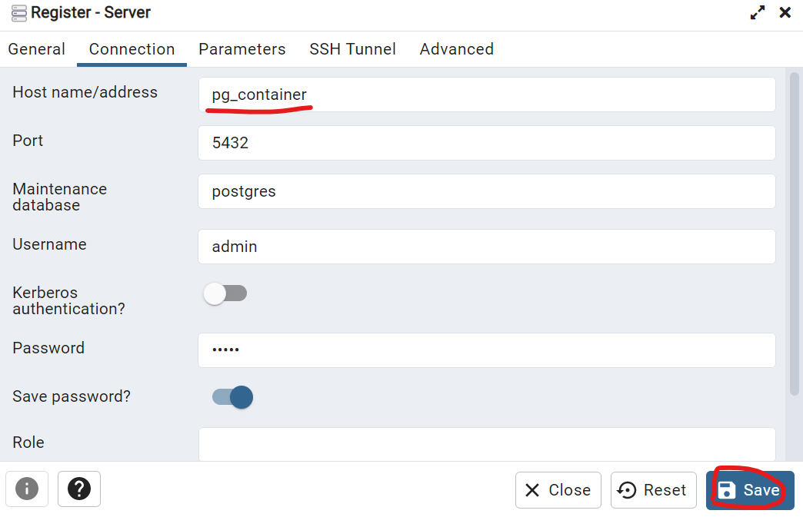

# Setup Postegres + PGAdmin

* Link Medium: [How to Run PostgreSQL and pgAdmin Using Docker](https://towardsdatascience.com/how-to-run-postgresql-and-pgadmin-using-docker-3a6a8ae918b5)
* [PgAdmin localhost:5050](http://localhost:5050/)

